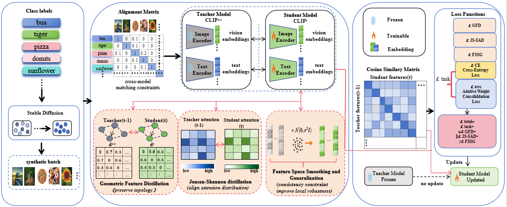

<h1 align="center">FARA: Forget-resistant Multi-level Knowledge Distillation for Continual Learning of Vision–Language Models</h1>

<p align="center">
Anonymous Submission
</p>

<p align="center">
    <!-- Update after the paper is publicly available -->
    
    
</p>

<p align="center">
    <a href="#overview">Overview</a> |
    <a href="#method">Method</a> |
    <a href="#environment-set-up">Environment Set Up</a> |
    <a href="#prepare-mtil-datasets">Prepare MTIL Datasets</a> |
    <a href="#synthetic-replay">Synthetic Replay</a> |
    <a href="#run-experiments">Run Experiments</a> |
    <a href="#results">Results</a> |
    <a href="#acknowledgement">Acknowledgement</a>
</p>

---

This is the official implementation of **FARA: Forget-resistant Multi-level Knowledge Distillation for Continual Learning of Vision–Language Models**.

Continual adaptation enables vision–language models (VLMs) to acquire knowledge from sequentially arriving domains. However, repeated model updates may erase previously learned task knowledge and weaken the zero-shot transferability inherited from large-scale pre-training.

To address these challenges, we propose **FARA**, a forget-resistant multi-level knowledge distillation framework for continual VLM adaptation.

Instead of constraining only parameters, logits, or individual feature vectors, FARA preserves knowledge at three complementary levels:

* **Geometric Feature Distillation (GFD)** preserves the relational geometry of the representation space.
* **Jensen–Shannon Self-Attention Distillation (JS-SAD)** aligns task-relevant spatial attention distributions.
* **Feature Space Smoothing and Generalization (FSSG)** regularizes local responses around intermediate representations.

Together, these objectives form a unified **geometry–attention–response knowledge protection mechanism**, improving the stability–plasticity trade-off during continual learning without introducing additional inference-time parameters.

---

## Overview

<p align="center">
    
</p>

<p align="center">
    <b>Figure 1. Overall framework of FARA.</b>
</p>

FARA follows a teacher–student continual adaptation paradigm with synthetic replay.

At continual-learning task (t), the checkpoint obtained after task (t-1) is frozen as the **teacher model**, while a copy of the model is optimized as the **student model**.

A mini-batch consists of:

* current-task training samples;
* synthetic replay samples corresponding to previously observed domains.

FARA preserves knowledge at three complementary levels during training:

### 1. Representation Geometry

**Geometric Feature Distillation (GFD)** transfers pairwise-distance and triplet-angle relations from the frozen teacher to the student, preserving the topology of the evolving representation space.

### 2. Spatial Attention

**Jensen–Shannon Self-Attention Distillation (JS-SAD)** aligns temperature-scaled spatial attention distributions between the teacher and student, encouraging the student to preserve task-relevant visual evidence.

### 3. Local Response Behavior

**Feature Space Smoothing and Generalization (FSSG)** injects a shared norm-bounded perturbation into intermediate representations and aligns the teacher and student responses after the remaining nonlinear encoder blocks.

The overall training objective is

[
\mathcal{L}_{\text{total}}
==========================

\mathcal{L}*{\text{task}}
+
\alpha\mathcal{L}*{\text{GFD}}
+
\beta\mathcal{L}*{\text{JS-SAD}}
+
\gamma\mathcal{L}*{\text{FSSG}}.
]

All auxiliary objectives are used only during training. FARA keeps the original CLIP inference path unchanged and introduces **no additional inference-time parameters**.

---

## Method

### Geometric Feature Distillation

Conventional pointwise feature matching constrains individual examples independently. Even when pointwise differences are small, the global representation manifold may still deform during sequential learning.

To better preserve structural knowledge, FARA introduces **Geometric Feature Distillation (GFD)**.

For teacher and student visual representations, GFD preserves:

* normalized pairwise distances;
* triplet-wise angular relations.

The complete geometric objective is

[
\mathcal{L}_{\text{GFD}}
========================

\lambda_d\mathcal{L}*{\text{dist}}
+
\lambda_a\mathcal{L}*{\text{angle}}.
]

Distance preservation constrains global sample separation, while angular preservation maintains local orientation.

The default internal weights are

```text
lambda_d = 1
lambda_a = 1
```

and the overall strength of GFD is controlled by (\alpha).

---

### Jensen–Shannon Self-Attention Distillation

Preserving the geometry of visual embeddings does not explicitly constrain which spatial tokens contribute to a prediction.

FARA therefore introduces **Jensen–Shannon Self-Attention Distillation (JS-SAD)**.

For selected visual Transformer layers, class-token-to-patch attention logits are transformed into temperature-scaled spatial probability distributions.

The teacher and student attention distributions are aligned using **Jensen–Shannon divergence**:

[
\operatorname{JS}(P^T \Vert P^S)
================================

\frac{1}{2}\operatorname{KL}(P^T\Vert M)
+
\frac{1}{2}\operatorname{KL}(P^S\Vert M),
]

where

[
M=\frac{1}{2}(P^T+P^S).
]

The symmetric and bounded Jensen–Shannon divergence provides stable attention transfer while preventing individual near-zero entries from dominating optimization.

---

### Feature Space Smoothing and Generalization

Matching teacher and student features at a single clean representation does not constrain their behavior in the local neighborhood of that representation.

To address this limitation, **Feature Space Smoothing and Generalization (FSSG)** perturbs intermediate visual representations instead of final embeddings.

A shared perturbation direction is injected into both teacher and student intermediate features. The perturbed features are subsequently propagated through the remaining nonlinear encoder blocks.

FARA then aligns:

* the perturbed semantic representations;
* the local response directions induced by the shared perturbation.

The FSSG objective is

[
\mathcal{L}_{\text{FSSG}}
=========================

\mathcal{L}*{\text{nei}}
+
\gamma*{\text{dir}}\mathcal{L}_{\text{dir}}.
]

We use

```text
gamma_dir = 1
```

in the default configuration.

This formulation regularizes the **local transformation behavior** of the model rather than simply matching noisy feature endpoints.

---

## Environment Set Up

Our implementation is based on **PyTorch** and uses **CLIP** as the base vision–language model.

The experiments reported in the paper were conducted on an **NVIDIA RTX 4090 GPU**.

We recommend creating an isolated Conda environment:

```bash
conda create -n fara python=3.8
conda activate fara
```

Install PyTorch according to your CUDA version and then install the remaining dependencies:

```bash
pip install -r requirements.txt
```

> Please adjust the Python, PyTorch, and CUDA versions according to the final released environment configuration.

---

## Prepare MTIL Datasets

We evaluate FARA on the **Multi-Domain Task Incremental Learning (MTIL)** benchmark.

MTIL contains **11 heterogeneous visual recognition datasets with 1,201 classes**:

* Aircraft
* Caltech101
* CIFAR100
* DTD
* EuroSAT
* Flowers102
* Food101
* MNIST
* OxfordPets
* StanfordCars
* SUN397

The datasets arrive sequentially following two predefined task orders:

```text
MTIL Order I
MTIL Order II
```

A recommended data organization is:

```text
data/
├── aircraft/
├── caltech101/
├── cifar100/
├── dtd/
├── eurosat/
├── flowers102/
├── food101/
├── mnist/
├── oxfordpets/
├── stanfordcars/
└── sun397/
```

Please download each dataset from its official source and modify the corresponding paths in the project configuration files when necessary.

---

## Synthetic Replay

FARA does **not require storing real historical training samples**.

Instead, synthetic replay samples are used to revisit previously acquired domain knowledge during continual learning.

For a controlled comparison, FARA follows the same synthetic-replay setting as GIFT, including:

* the same pre-trained CLIP backbone;
* the same synthetic replay pool;
* the same generation prompts;
* the same replay budget.

The overall continual-learning process is

```text
Previous checkpoint
        │
        ▼
 Frozen Teacher
        │
        ├───────────────────────┐
        │                       │
Current-task data       Synthetic replay data
        │                       │
        └───────────┬───────────┘
                    │
                    ▼
             Trainable Student
                    │
                    ▼
       Multi-level Distillation
        ├── GFD
        ├── JS-SAD
        └── FSSG
                    │
                    ▼
              Updated Model
```

From the second task onward, the checkpoint obtained after the previous task is frozen and serves as the teacher for the current adaptation stage.

---

## Run Experiments

Each task is trained for **1,000 iterations** using **AdamW**.

The main settings reported in the paper are:

```yaml
optimizer: AdamW
iterations_per_task: 1000
batch_size: 64

learning_rate:
  - 1e-5
  - 5e-5

label_smoothing: 0.2

FARA:
  alpha: 100
  beta: 0.5
  gamma: 2.0
  epsilon: 0.1

GFD:
  lambda_distance: 1
  lambda_angle: 1

FSSG:
  gamma_direction: 1
```

The corresponding objective is

```text
L_total
    =
L_task
    +
alpha * L_GFD
    +
beta * L_JS-SAD
    +
gamma * L_FSSG
```

### MTIL Order I

After configuring the dataset paths and experiment configuration, run the corresponding Order I configuration.

```bash
# Example
python ./scripts/run_exp.py --config_path=./configs/mtil_order_I.json
```

### MTIL Order II

```bash
# Example
python ./scripts/run_exp.py --config_path=./configs/mtil_order_II.json
```

> If your final training entry script or configuration filenames differ, replace the commands above with the corresponding paths in the repository.

---

## Results

Following the MTIL evaluation protocol, we report three metrics:

* **Transfer** evaluates zero-shot accuracy on tasks that have not yet been encountered and mainly reflects forward transfer and plasticity.
* **Average** summarizes performance throughout the complete continual-learning sequence.
* **Last** reports final average accuracy over learned tasks and mainly reflects knowledge retention and stability.

### MTIL Order I

| Method                | Transfer |     Avg. |     Last |
| --------------------- | -------: | -------: | -------: |
| Zero-shot             |     69.4 |     65.3 |     65.3 |
| Continual Fine-Tuning |     44.6 |     55.9 |     77.3 |
| LwF                   |     56.9 |     64.7 |     74.6 |
| iCaRL                 |     50.4 |     65.7 |     80.1 |
| LwF-VR                |     57.2 |     65.1 |     76.6 |
| WiSE-FT               |     52.3 |     60.7 |     77.7 |
| ZSCL                  |     68.1 |     75.4 |     83.6 |
| DIKI                  |     68.7 |     76.3 |     85.1 |
| MoE-Adapter           |     68.9 |     76.7 |     85.0 |
| GIFT                  |     69.3 |     77.3 |     86.0 |
| IAP                   |     69.2 |     76.8 |     85.7 |
| **FARA (Ours)**       | **70.1** | **78.1** | **86.6** |

Compared with GIFT, FARA improves:

```text
Transfer : +0.8
Average  : +0.8
Last     : +0.6
```

---

### MTIL Order II

| Method                | Transfer |     Avg. |     Last |
| --------------------- | -------: | -------: | -------: |
| Zero-shot             |     65.4 |     65.3 |     65.3 |
| Continual Fine-Tuning |     46.6 |     56.2 |     67.4 |
| LwF                   |     53.2 |     62.2 |     71.9 |
| iCaRL                 |     50.9 |     56.9 |     71.6 |
| LwF-VR                |     53.1 |     60.6 |     68.3 |
| WiSE-FT               |     51.0 |     61.5 |     72.2 |
| ZSCL                  |     64.2 |     74.5 |     83.4 |
| DIKI                  |     64.4 |     74.5 |     85.5 |
| MoE-Adapter           |     64.3 |     74.7 |     84.1 |
| GIFT                  | **65.9** |     75.7 |     85.3 |
| IAP                   |     64.9 |     75.1 |     85.9 |
| **FARA (Ours)**       | **65.9** | **76.3** | **86.3** |

Under Order II, FARA matches GIFT in Transfer while improving:

```text
Average : +0.6
Last    : +1.0
```

These results demonstrate that FARA improves historical-task retention while maintaining strong forward-transfer capability.

---

## Ablation Study

We further evaluate the contribution of each component on MTIL Order I.

| Method     | Transfer |     Avg. |     Last |
| ---------- | -------: | -------: | -------: |
| w/o JS-SAD |     69.5 |     77.6 |     85.9 |
| w/o GFD    |     69.8 |     77.8 |     86.5 |
| w/o FSSG   |     69.9 |     77.9 |     85.6 |
| **FARA**   | **70.1** | **78.1** | **86.6** |

The full FARA model achieves the best performance across all three metrics.

Removing **JS-SAD** decreases Transfer, Average, and Last, confirming the importance of task-relevant attention preservation.

Removing **GFD** results in smaller but consistent performance degradation, demonstrating the benefit of preserving relational feature geometry.

Removing **FSSG** causes the largest decrease in Last accuracy, highlighting the importance of local response regularization for long-term knowledge retention.

---

## Stability–Plasticity Trade-off

Continual learning requires balancing two competing objectives:

```text
Plasticity
    ↓
Ability to learn and transfer to new domains

Stability
    ↓
Ability to retain previously acquired knowledge
```

FARA achieves a favorable balance between these two objectives.

On MTIL Order I, FARA simultaneously improves **Transfer** and **Last** over GIFT instead of improving one metric at the expense of the other.

This indicates that multi-level knowledge preservation can protect historical and pre-trained knowledge without excessively restricting adaptation to newly arriving domains.

---

## Representation Analysis

After sequential learning of all 11 tasks, representation-space visualization shows that FARA produces:

* more compact within-task clusters;
* clearer boundaries between several task groups;
* less dense central overlap in the representation space.

These observations are consistent with the complementary roles of the three FARA modules:

```text
GFD
 └── Preserve relational geometry

JS-SAD
 └── Preserve task-relevant visual attention

FSSG
 └── Regularize local response behavior
```

Together, the three components produce a more structured representation space after long-term continual adaptation.

---

## Cross-domain Analysis

We further compare FARA and GIFT over the complete **11 × 11 MTIL training–evaluation matrix**.

FARA achieves positive improvements over GIFT on:

```text
92 / 121 source-target pairs
```

with an average improvement of approximately

```text
+0.92 percentage points
```

Positive gains appear across both nearby and temporally distant task pairs, indicating that FARA reduces cross-domain interference across much of the continual-learning sequence.

Negative transfer remains under several severe distribution shifts, suggesting future directions such as:

* domain-aware loss weighting;
* adaptive perturbation-layer selection;
* dynamic multi-level distillation strategies.

---

## Computational Cost

All FARA auxiliary objectives are used only during training.

* **GFD** uses vectorized pairwise computations and sampled triplets.
* **JS-SAD** reuses attention maps produced by the visual backbone.
* **FSSG** adds one perturbed encoder-tail forward pass.

The resulting deployment properties are:

| Property                                    | FARA    |
| ------------------------------------------- | ------- |
| Additional inference parameters             | **0**   |
| Modification to CLIP inference architecture | **No**  |
| Additional inference latency                | **No**  |
| Approximate training-time increase          | **~5%** |

Therefore, FARA improves continual knowledge retention without modifying the original inference architecture.

---

## Citation

The paper is currently under anonymous review.

The official citation will be updated after publication.

```bibtex
@inproceedings{fara,
  title     = {FARA: Forget-resistant Multi-level Knowledge Distillation for Continual Learning of Vision--Language Models},
  author    = {Anonymous},
  booktitle = {To appear},
  year      = {To appear}
}
```

---

## Acknowledgement

Our work builds upon prior research in continual learning, vision–language model adaptation, knowledge distillation, and synthetic replay.

In particular, FARA follows the MTIL continual-learning setting and uses **GIFT** as an important synthetic-replay baseline.

We sincerely thank the authors of the related open-source projects, benchmarks, and datasets for making their work available to the research community.

---

## TODO

* [ ] Release source code
* [ ] Add official paper / arXiv link
* [ ] Add authors and affiliations
* [ ] Add complete environment configuration
* [ ] Add dataset preparation instructions
* [ ] Add synthetic-data generation commands
* [ ] Verify MTIL Order I / II training commands
* [ ] Release pretrained checkpoints
* [ ] Add evaluation scripts
* [ ] Update official BibTeX citation
